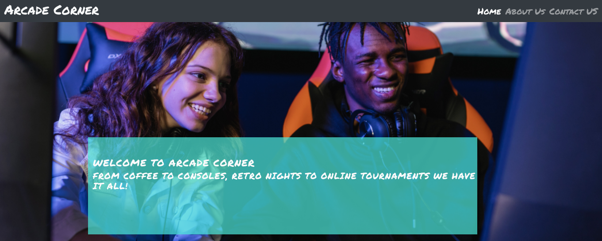
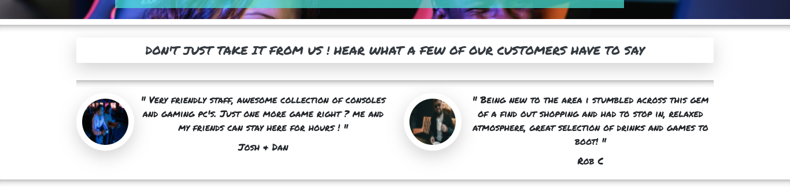
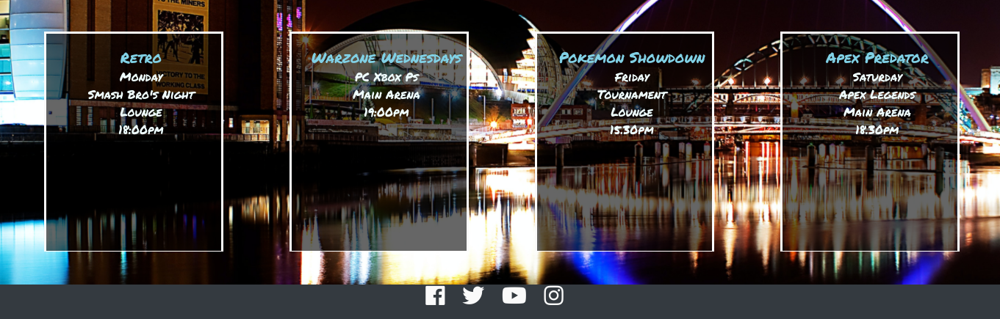
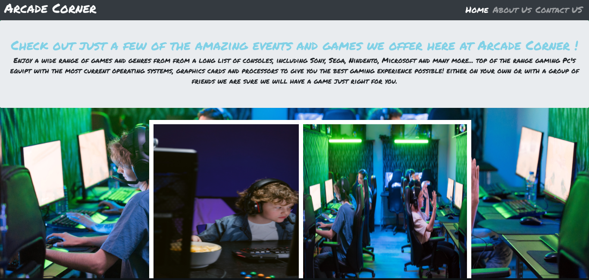
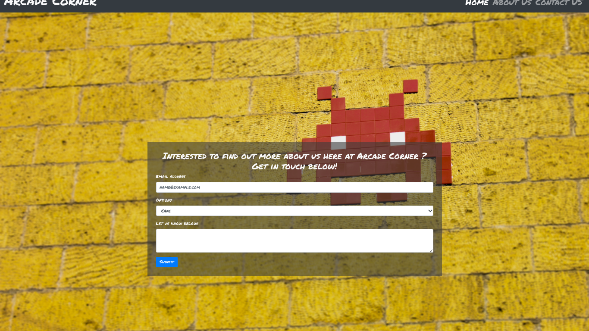
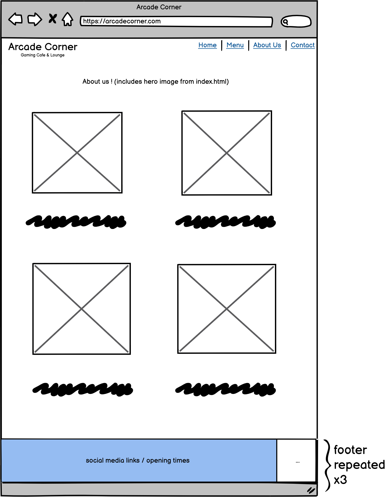
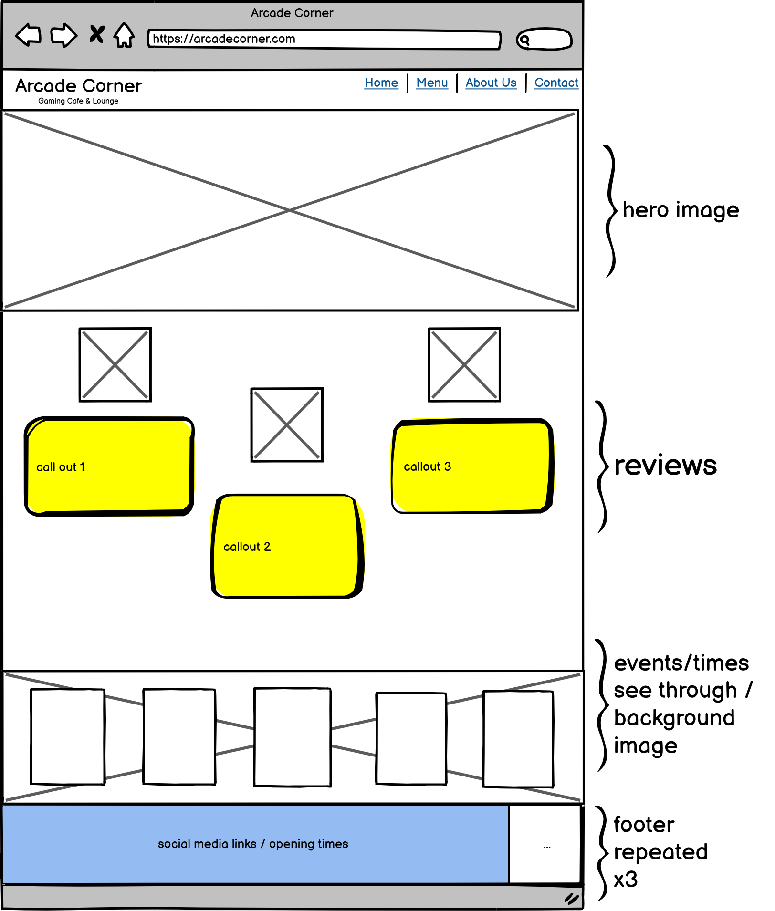
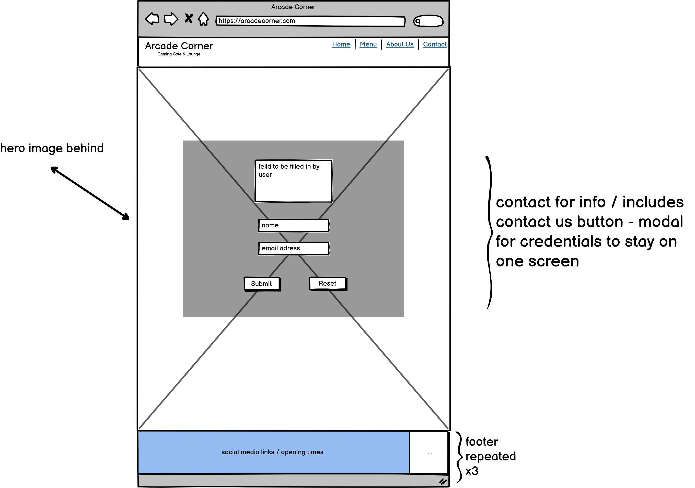
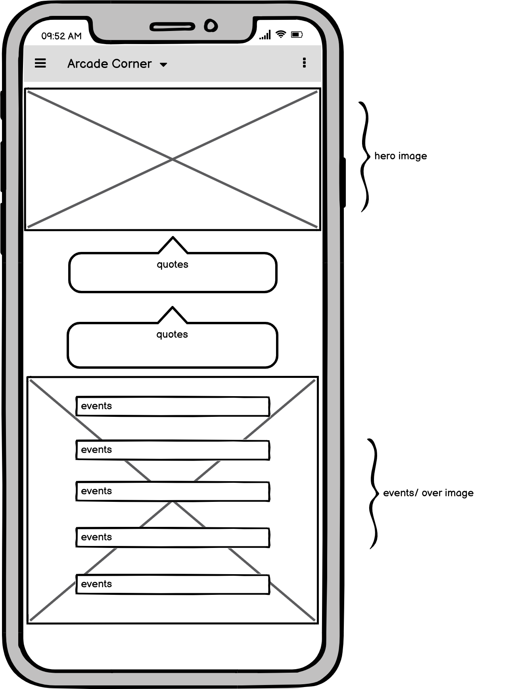

# Arcade Corner

## Code Institue Diploma in Web Application Development MS1 Project
 
 - This is my first portfolio project called Arcade Corner a new and up and coming fictional gaming and cafe lounge in the heart of Newcastle Upon Tyne.

 - This is a 3 page responsive website featuring a home, about and contact us sections. Showcasing events, offers, themed days, consoles, Gaming Pc's, hand held devices and many more.

#

[Enter the site] (https://liamnichol.github.io/Arcade-Corner-MS1/)

## Table of Contents

## UX and UI

- ### Site Owner Goals

  The goal of the site for the owner is to:

  1. Increase door trade by having an appealing and informative website.
  2. Offer a an affordale option for people unable to eperience  high-end, high-spec gaming computers, consoles and devices for people who cannot afford to purchase them.
  3. Highlight tournaments, networking events, Retro nights, watch parties. 
  4. Spread the word that a brand new Gaming cafe and lounge has opened up in the area.

#

- ### User Stories

  - #### First Time Visitor Goals

    1. As a first time user, I want easily find what Arcade Corner offers. 
    2. As a first time user, I want to be able to easily navigate around the site and its content.
    3. As a first time user, I'd like to see reviews, previous events, New consoles/hardware

  - #### Returning Visitor Goals

    1. As a returning visitor, I want to find information about any new events lined up or additions to the cafe/lounge.
    2. As a returning visitor, I want to easily find information about any upcoming events.
    3. As a returning visitor, I want to find the best way to keep up to date or get in touch.

  - #### Commercial Visitor Goals

    1. As a commercial visitor, i want the ability to be able to view and identify what the store offers and any sponsership opertunities/fund raisers.

# Project Screen shots

## Landing page nav bar and hero image

- As you first enter the site the user is greated by an eye catching hero image with zoom, overlay text and a stylish yet simple dark navbar.

## Quotes Section 

- Front and center of the page are two posative reviews targeting both areas that the busines offers, this being a cafe/lounge and a gaming zone with multiple areas.

- Referenceing reviews from both returning customers and a new customer.

## Events 

- In the events section the users gets to view weekly run events, different event types, days and times. All with a backdrop of Newcastle.

## About us page

- This page showcases 4 of the events held or ran at the busines, updates to this page are planned to be made to add text overlay across the grid images to give a description for easier navigation.

## Contact Page

- Bright bold background to catch the users attention and draw them into the screen, accompanied by a subtle form area with multiple optoins to choose from and an additional text area.

## Technologies used
---
* [Git](https://git-scm.com/) Version control
* [GitHub](https://github.com/) Files, documents and deployment of the website
* [HTML5](https://en.wikipedia.org/wiki/HTML) Markup
* [CSS3](https://en.wikipedia.org/wiki/CSS) Stylesheet
* [Bootstrap](https://getbootstrap.com/) Structure and CDN for the website
* [Google Fonts](https://fonts.google.com/) Fonts

---
### Technical coding assistance
* [Code Institute](https://codeinstitute.net/) 
* [W3schools](https://www.w3schools.com/)
* [Slack](https://slack.com/intl/en-gb/)

### Images
 
 - All images used within this site across all three pages were taken from the below sources.(Authors of photos in credits section)

 - All images have been selected to both catch the eye of the user and to give the user a feeling of familiarity with the images being commonly used with in the gaming industry. Making the site relatable and easier to navigate through each section for both new and returning users.

* [Pexels](https://www.pexels.com/)

### Font 

* The font used within this website was taken from google fonts - [Google Fonts](https://fonts.google.com/) Fonts - the font chosen was a font called 'Permanent Marker' which complimets the arcade gaming theme.

### Colors (colours)

* the color used for the main body of the website was a simple #fafafa white so the wording stood out ina mostly dark back ground, changing to cyan blue where needed to contrast against the background.

## Testing 
---
 ## Lighthouse Testings
 

This website was also tested using the lighthouse chrome developer extention and the results are as follows.
 
 - updates to be made to websites assesability options for screen readers and compression of images to reduce loading time. Color contracts between sections works well yet can be improves to distinguish between sections.
 

## Validation
---
* To validate my HTML5 code i used the following website (https://validator.w3.org/nu/?showsource=yes&doc=https%3A%2F%2Fliamnichol.github.io%2FArcade-Corner-MS1%2F)

 * To validate CSS [https://jigsaw.w3.org/css-validator/]

## Wireframes

---

Current wireframes created fot the website to showcase the initial ideas behind the finished design, 

* About Section 
* Home Page 
* Contact Section 
* Mobile home page 

- website to continue to be update to reach full potention of wire frames and ideas of author, upades to wire frames will continue also.

## Responsiveness
---

 Developer Tools inside a chrome brower were used  extensivly to check the responsiveness of website. Mobile, tablet and desktop sizes were tested.

 Testing across all availible devices inside the developer tools on a chrome browser.

 further responsive tests ran on a hp chromebook,samsung galaxy s21 & s1 plus.

## Bugs during development
---
- home page events section bug when lowering down screen sizes,bug fix = display set to none when below a screensize of 600px.

- callout section inside hero image bug when lowering down screen sizes,bug fix = display set to none when below a screensize of 600px.

- background image on contact.html shows durnglive preview in gitpod, yet does not display on my live website. html and code passed.

## Version Control
---

### Git & GitHub

I used **[GitPod](https://gitpod.io/)** as a local repository and IDE and **[GitHub](https://github.com/)** as a remote repository. The process of version control was:

* First i created a new repository on GitHub 
* I have then opened that repository on GitPod and started coding
* In GitPod i have created all the pages and and folders 
* I was then saving my work and pushing it to GitHub repository to keep it safe
* Process for saving, commiting and pushing it to remote repository goes as follows (done in terminal):
*   * `git add . `  for adding work to git
    * `git commit -m "Commit message" `  to commit the work on the stage
    * `git push `  to update work to GitHub

## Deployment
---

To deploy the website, I followed the below steps on [GitHub](https://github.com/).
1. Go to **"Settings"** on the repository
2. On **"Source"** of **"GitHub Pages"**, select **"master** for Branch and click save
3. The website is now published on GitHub Pages and the link is provided on on the same section
 
  ## Languages

  - [HTML5](https://en.wikipedia.org/wiki/HTML5)
  - [CSS](https://en.wikipedia.org/wiki/CSS)
  - [Bootstrap](https://getbootstrap.com/)

## Credits

 - Photo by Alena Darmel from [Pexels](https://www.pexels.com/@a-darmel?utm_content=attributionCopyText&utm_medium=referral&utm_source=pexels)
 - Photo by RODNAE Productions from [Pexels](https://www.pexels.com/@rodnae-prod?utm_content=attributionCopyText&utm_medium=referral&utm_source=pexels)
 - Photo by Tima Miroshnichenko from [Pexels](https://www.pexels.com/photo/a-boy-playing-a-computer-game-7046690/?utm_content=attributionCopyText&utm_medium=referral&utm_source=pexels)
 - Photo by Ron Lach from [Pexels](https://www.pexels.com/@ron-lach?utm_content=attributionCopyText&utm_medium=referral&utm_source=pexels)
 - Photo by Garon Piceli from [Pexels](https://www.pexels.com/@garonpiceli?utm_content=attributionCopyText&utm_medium=referral&utm_source=pexels)
 - Photo by Jens Mahnke from [Pexels](https://www.pexels.com/@atomlaborblog?utm_content=attributionCopyText&utm_medium=referral&utm_source=pexels)
 - Photo by Geoff Duke from [Pexels](https://www.pexels.com/@geoffduke?utm_content=attributionCopyText&utm_medium=referral&utm_source=pexels) 
 - Photo by Francesco Ungaro from [Pexels](https://www.pexels.com/@francesco-ungaro?utm_content=attributionCopyText&utm_medium=referral&utm_source=pexels)

 * insperation for styling and layout  for the events section contained within the home page was taken from Code Institutes Love Runnning project.

 # Special mentions 
   - Spencer Barriball [Mentor]
   - Peer Support [Slack]